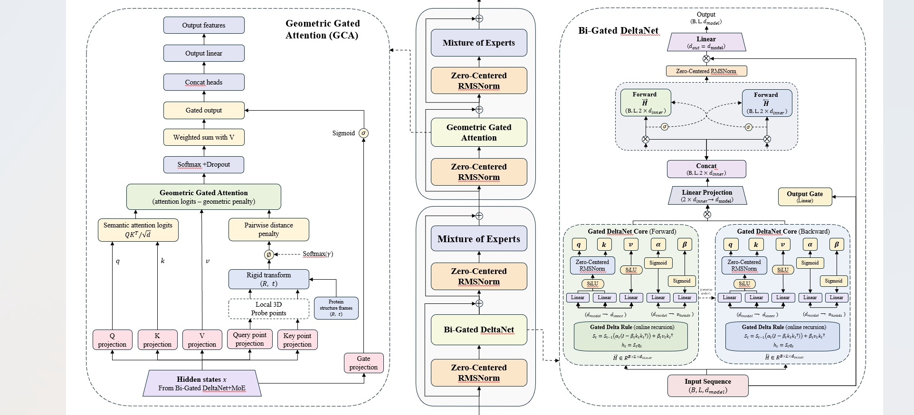
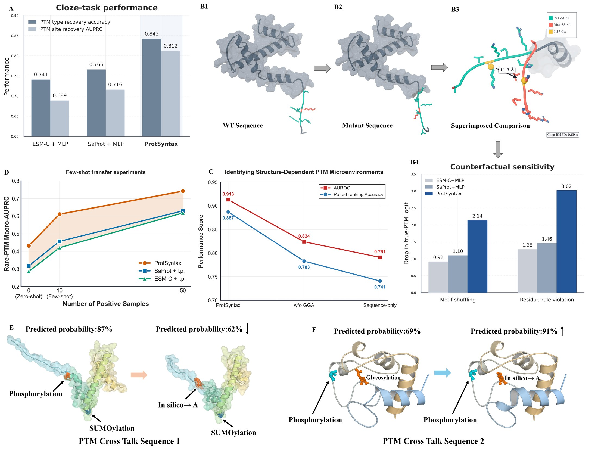
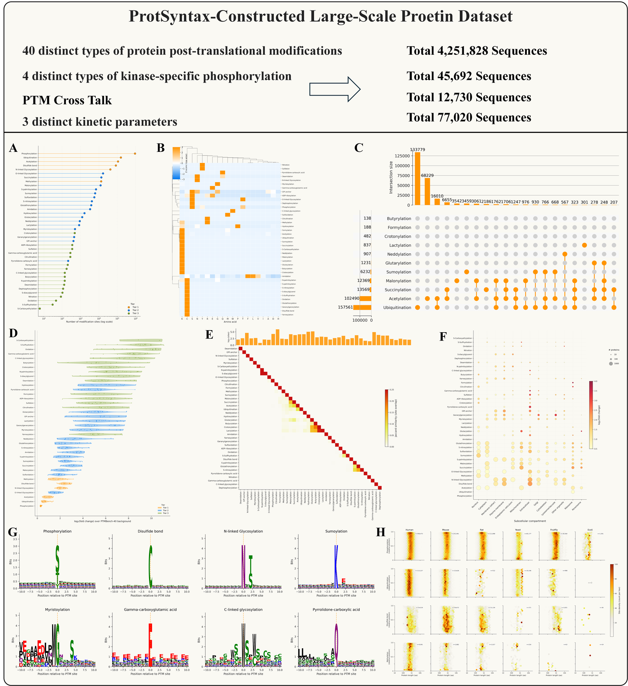
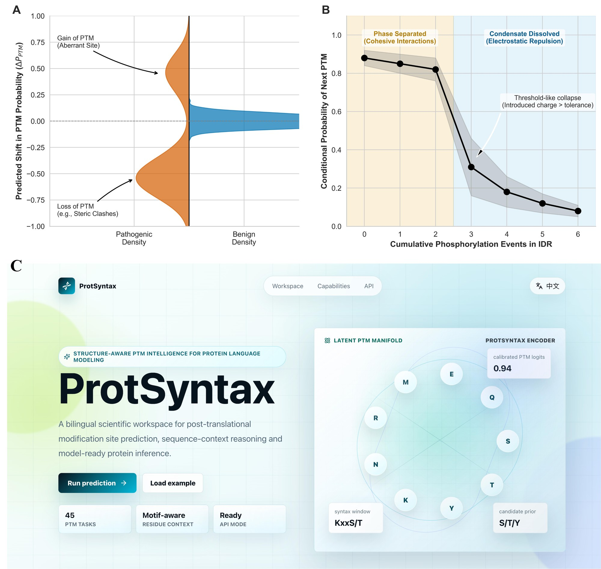
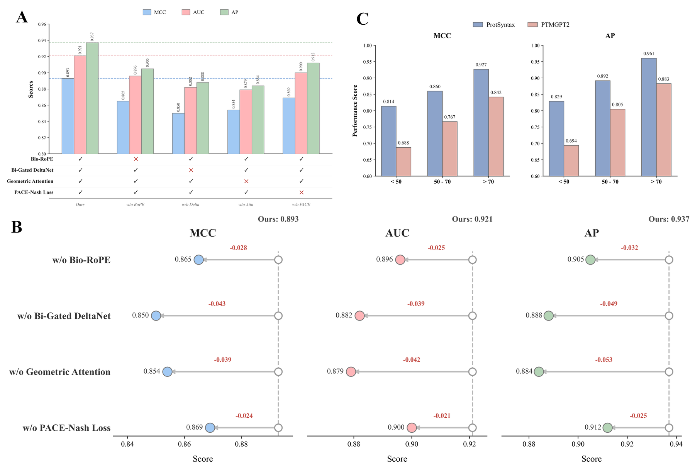
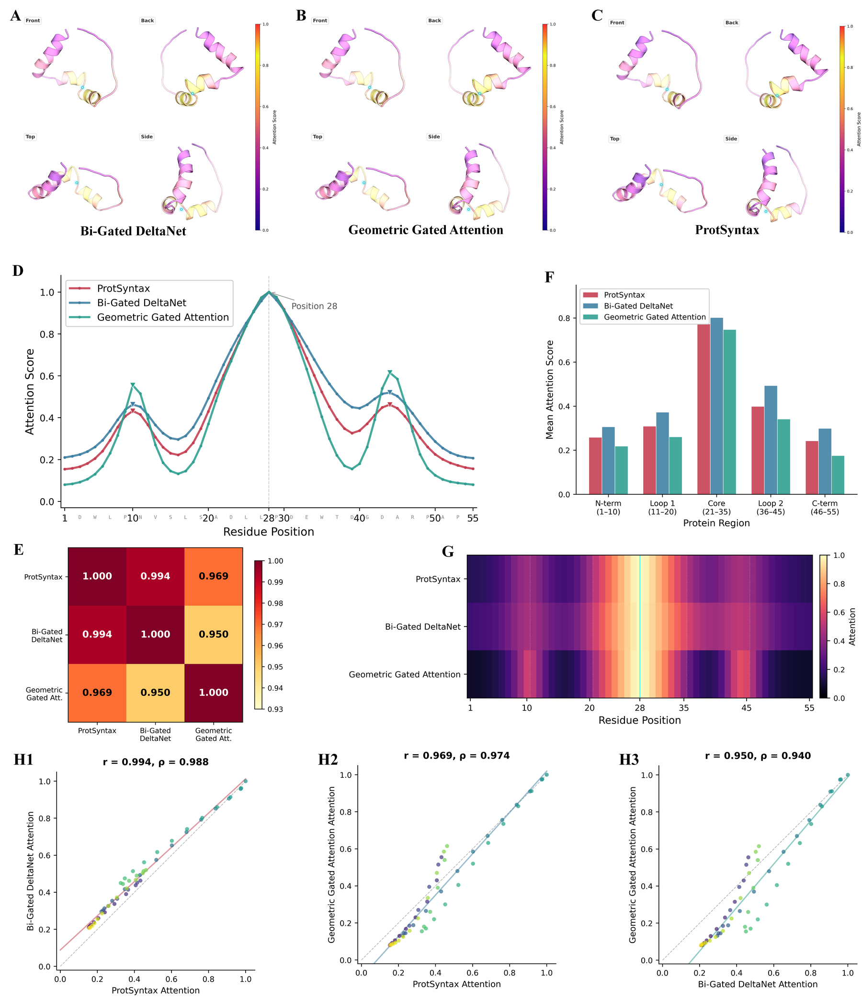

<div align="center">

# ProtSyntax

**A PTM-aware protein language model for decoding post-translational modification syntax and function**

<p>
  <a href="LICENSE"></a>
  
  
  
  
</p>



</div>

## Overview

ProtSyntax is a protein large language model designed to learn the regulatory grammar of post-translational modifications (PTMs). Instead of treating PTM prediction as isolated site annotation, ProtSyntax models residue chemistry, long-range sequence context, folded structural microenvironments, PTM crosstalk, and protein-level functional consequences in one shared representation.

The repository contains the core ProtSyntax modules, a lightweight inference demo, visual material extracted from the manuscript, and documentation for the public dataset and external model weights.

For model scope, limitations, and recommended reporting practice, see [MODEL_CARD.md](MODEL_CARD.md).

## Highlights

| Capability | ProtSyntax target |
|---|---|
| PTM language learning | Cloze-style PTM type recovery, PTM site recovery, rare-PTM transfer |
| Structural reasoning | Geometric Gated Attention injects residue-frame distance penalties into attention logits |
| Long-context sequence propagation | Bi-Gated DeltaNet scans proteins in both N-to-C and C-to-N directions |
| PTM-aware positional encoding | Bio-RoPE combines secondary-structure periodicity, amino-acid physicochemical phase shifts, and standard RoPE |
| Multi-task optimization | PACE-Nash couples PTM classification, enzyme kinetic regression, contrastive alignment, and adaptive task weighting |

## Technical Snapshot

### Model Design

ProtSyntax is built around three PTM-specific modeling ideas:

1. **Bio-RoPE** encodes protein positional syntax using structural periodic channels, physicochemical phase modulation, and long-range rotary channels.
2. **Bi-Gated DeltaNet** propagates contextual evidence bidirectionally so that a candidate residue is evaluated with both upstream and downstream sequence constraints.
3. **Geometric Gated Attention** adds a learnable 3D microenvironment correction, suppressing residue pairs that are semantically compatible but geometrically implausible.

The shared encoder supports residue-centered PTM tasks and full-length enzyme kinetic regression through task-specific prediction heads.

### Learning Objective

PACE-Nash combines:

| Component | Purpose |
|---|---|
| Asymmetric focal classification | Handles extreme positive/negative imbalance in PTM site labels |
| Correlation-aware contrastive loss | Aligns proteins or windows with related PTM patterns |
| Evidential log-normal regression | Models uncertainty in enzyme kinetic measurements |
| Physicochemical manifold penalty | Preserves coarse biophysical topology in latent space |
| Nash-style adaptive weighting | Reduces destructive gradient interference among objectives |

## Benchmark Summary

The manuscript reports broad improvements across PTM and enzyme benchmarks:

| Evaluation | Representative result |
|---|---|
| 40-class PTM site prediction | Mean MCC +12.66% and AP +10.67% over the strongest baseline |
| PTM-type cloze recovery | Accuracy 0.842 |
| PTM-site recovery | Site-ranking AUPRC 0.812 |
| Structure-dependent PTM microenvironment decoys | AUROC 0.913, AUPRC 0.786 |
| Rare PTM transfer | Macro-AUPRC 0.432 zero-shot, 0.611 with 10 positives, 0.742 with 50 positives |
| Enzyme kinetic regression | Mean R2 +8.09%, MAE reduced by 10.7% |

<p align="center">
  
</p>

<p align="center"><b>Learning paradigm.</b> ProtSyntax recovers PTM type/site syntax, resists counterfactual perturbations, resolves structure-dependent microenvironments, and transfers to low-resource PTM classes.</p>

## Dataset

ProtSyntax is trained and evaluated on a PTM-centered benchmark corpus:

| Dataset block | Scale |
|---|---:|
| General PTM site prediction | 348,903 positive and 3,902,925 negative site-centered samples |
| PTM classes | 40 |
| Kinase-specific phosphorylation | 3,803 positive and 41,889 negative samples |
| PTM crosstalk | 262 positive and 12,468 negative samples |
| Enzyme kinetic regression | 170,290 protein-function records |

The dataset is hosted on Hugging Face and documented in [Data/README.md](Data/README.md).

<p align="center">
  
</p>

## Generalization And Interpretability

ProtSyntax extends PTM syntax to disease variant effect prediction, condensate dynamics, and web-based deployment scenarios. Ablation experiments indicate that Bio-RoPE, Bi-Gated DeltaNet, Geometric Gated Attention, and PACE-Nash each contribute to performance and robustness under uncertain structural inputs.

<p align="center">
  
</p>

<p align="center">
  
</p>

<details>
<summary><b>Interpretability figure</b></summary>

<p align="center">
  
</p>

</details>

## Repository Layout

```text
ProtSyntax/
|-- Core_code/              # Core model modules: Bio-RoPE, Bi-Gated DeltaNet, GGA, PACE-Nash
|-- Data/                   # Dataset card and loading instructions
|-- Model_weight/           # Model-weight release policy; checkpoints are not tracked by git
|-- assets/figures/         # README figures extracted and optimized from the manuscript
|-- docs/                   # Release checklist and review-facing notes
|-- scripts/                # Optional local release helpers
|-- demo.py                 # Minimal prediction demo
|-- MODEL_CARD.md           # Intended use, limitations, and reporting guidance
|-- requirements.txt        # Runtime dependencies
|-- CITATION.cff            # Citation metadata
`-- LICENSE                 # Apache-2.0
```

## Installation

```bash
git clone <your-protsyntax-repository-url>
cd ProtSyntax
python -m venv .venv
source .venv/bin/activate
pip install -r requirements.txt
```

For GPU inference, install the PyTorch build that matches your CUDA runtime before installing the remaining dependencies.

## Quick Start

Place the released model files in a local path such as `Model_weight/ProtSyntax/`, prepare a protein sequence and matching PDB structure, then run:

```bash
python demo.py \
  --model Model_weight/ProtSyntax \
  --sequence MKTIIALSYIFCLVFADYKDDDDAMAKTIIALSYIFCLVFA \
  --pdb example_protein.pdb \
  --chain A
```

The demo illustrates:

1. loading a tokenizer and model with `transformers`;
2. extracting C-alpha coordinates from a PDB chain with Biopython;
3. passing sequence tokens and structural coordinates to ProtSyntax;
4. reporting high-probability PTM sites.

## Core Modules

```python
from Core_code import BioRoPE, BiGatedDeltaNet, GeometricGatedAttention, PACENashLoss
```

| Module | File | Role |
|---|---|---|
| `BioRoPE` | `Core_code/rope.py` | PTM-aware rotary positional encoding |
| `BiGatedDeltaNet` | `Core_code/bi_gated_deltanet.py` | Efficient bidirectional long-context propagation |
| `GeometricGatedAttention` | `Core_code/attention.py` | Structure-constrained semantic attention |
| `PACENashLoss` | `Core_code/loss.py` | Multi-task PTM/function optimization objective |

## Model Weights

Model checkpoints are released separately and are not committed to this repository. See [Model_weight/README.md](Model_weight/README.md) for the expected local layout and release policy.

## License

This project is released under the [Apache-2.0 license](LICENSE).

## Citation

If you use ProtSyntax in academic work, please cite the accompanying manuscript:

```bibtex
@article{lin2026protsyntax,
  title   = {ProtSyntax: a protein large language model for decoding post-translational modification syntax and function},
  author  = {Lin, Yiyu},
  year    = {2026},
  note    = {Manuscript in preparation}
}
```
